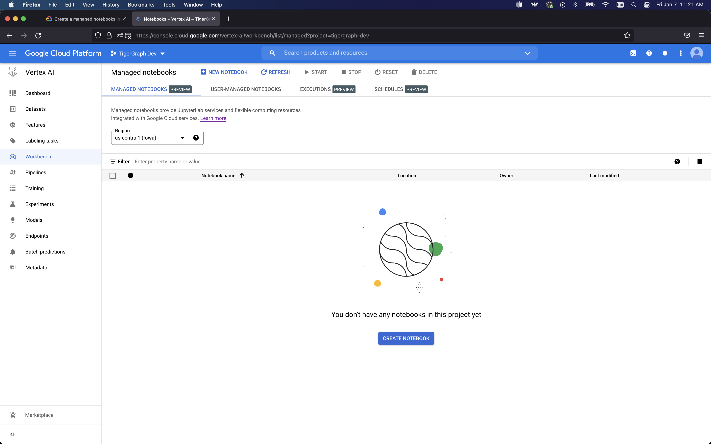
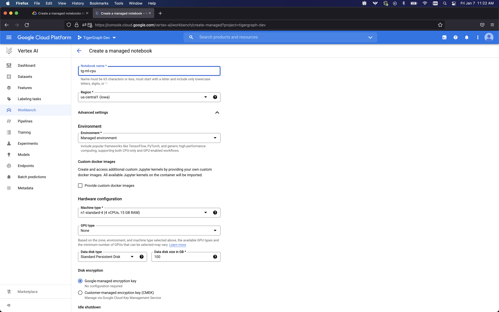
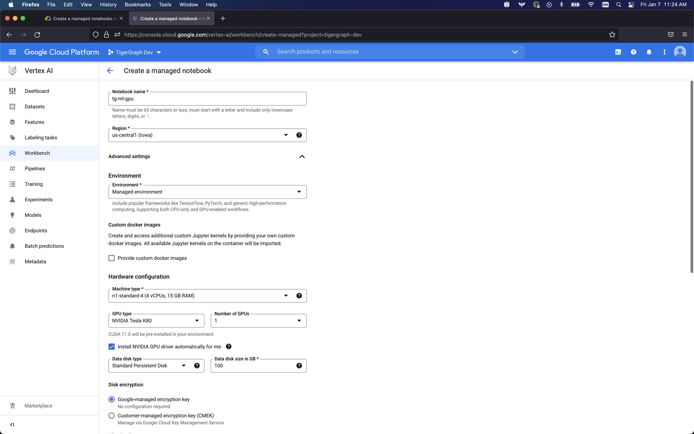
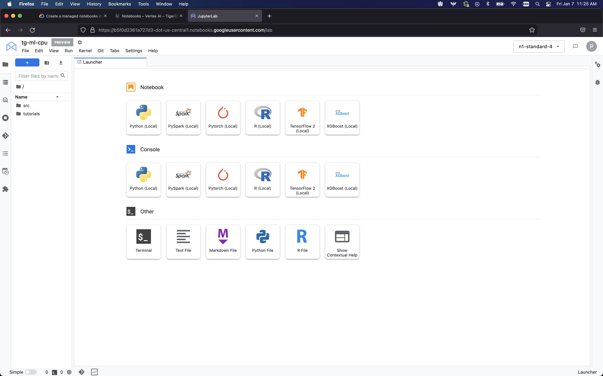
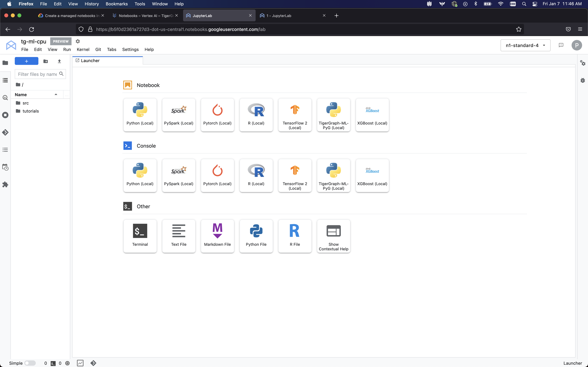

# Graph Machine Learning with TigerGraph and GCP

## Setup TigerGraph Database
### Install TigerGraph
As we are utilizing Google Vertex AI, we are also utilizing GCP compute resources to host our TigerGraph database. You can host your database on any sufficiently powerful, publicly accessible compute instance however. Once the instance was provisioned, ssh into the instance, and follow the TigerGraph installation instructions found here: [https://docs.tigergraph.com/tigergraph-server/current/installation/install](https://docs.tigergraph.com/tigergraph-server/current/installation/install).

### Install Graph Data Processing Service
In addition to the TigerGraph database server, we need to install an additional component called the Graph Data Processing Service, or GDPS. This will facilitate the graph sampling and other functionality needed to extract data from the graph for the model training process. To install the GDPS, follow the steps listed [here](https://github.com/TigerGraph-DevLabs/GDPS) in the home directory of the user where TigerGraph is installed.


## Setup Vertex AI Notebook
### Create a new Vertex AI Notebook
From the Vertex AI Dashboard, create a new Notebook. This will be the notebook that will be used to train the model. To do this, click on the "Create New Notebook" button.


#### CPU Version
The CPU setup is pretty straightforward. Name your notebook, select the region where you want to deploy the notebook, and then the machine type. Scrol to the bottom of the page and click on the "Create" button.


#### GPU Version
The GPU setup is a little more complicated. Name your notebook, select the region where you want to deploy the notebook, and then the machine type. Then, select the GPU type you wish to use in the notebook, and select "Install NVIDIA GPU driver automatically for me". Then, scroll to the bottom of the page and click on the "Create" button.


### Install Conda Environment
Once you have created your notebook, you should be able to click on the "OPEN JUPYTERLAB" link from the notebook homepage. This will open up the JupyterLab environment, which looks something like this:

#### CPU Version
If you wish to install PyTorch Geometric, you can copy the below commands exactly. If you wish to use DGL, then you will want to change the `conda env create` command to `conda env create -f https://raw.githubusercontent.com/parkererickson/tgml-google-vertex/main/dgl-environment-cpu.yml`, and change the display name after the environment is created.
Once you have JupyterLab open, navigate to the terminal and run the following commands:
```sh
conda env create -f https://raw.githubusercontent.com/parkererickson/tgml-google-vertex/main/pyg-environment-cpu.yml
conda activate tigergraph-ml
python -m ipykernel install --user --name tigergraph-ml --display-name TigerGraph-ML-PyG
conda deactivate
```

After the environment is created, you should be able to navigate to the home screen of the JupyterLab and click on the "TigerGraph-ML-PyG" kernel icon (You might have to refresh the page as well). This will open up the JupyterLab kernel with all the necessary dependencies installed. It should look something like this:

#### GPU Version
If you wish to install PyTorch Geometric, you can copy the below commands exactly. If you wish to use DGL, then you will want to change the `conda env create` command to `conda env create -f https://raw.githubusercontent.com/parkererickson/tgml-google-vertex/main/dgl-environment-cpu.yml`, and change the display name after the environment is created.
Once you have JupyterLab open, navigate to the terminal and run the following commands:
```sh
conda env create -f https://raw.githubusercontent.com/parkererickson/tgml-google-vertex/main/pyg-environment-gpu.yml
conda activate tigergraph-ml
python -m ipykernel install --user --name tigergraph-ml --display-name TigerGraph-ML-PyG
conda deactivate
```

After the environment is created, you should be able to navigate to the home screen of the JupyterLab and click on the "TigerGraph-ML-PyG" kernel icon (You might have to refresh the page as well). This will open up the JupyterLab kernel with all the necessary dependencies installed. It should look like the CPU version shown above.

## Clone Tutorial Repository
To clone the tutorial repository, navigate to the terminal and run the following commands:
```sh
git clone https://github.com/tg-bill/mlworkbench-docs.git
```
You will be all set to start using the tutorials in Google Vertex AI notebooks.


